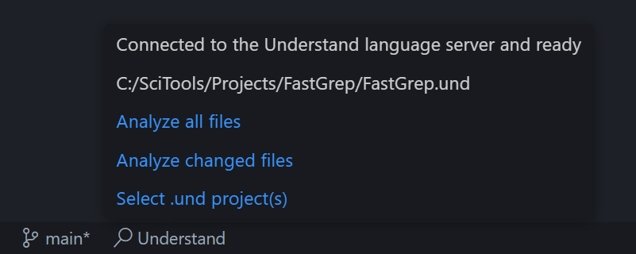

# Understand for Visual Studio Code

The Software Developer's Multi-Tool for Visual Studio Code

## Features

* See violations in the editor
	* Errors from compiling and analyzing
	* Warnings from your selected [CodeCheck](https://support.scitools.com/support/solutions/articles/70000583282-codecheck-overview) groups (CodeCheck configurations)

* Here are 2 ways to analyze files
	* Automatically analyze files on save... or
	* Manually analyze files with a [command](https://code.visualstudio.com/api/extension-guides/command)

* [Supported languages](https://support.scitools.com/support/solutions/articles/70000582794-supported-languages)
	* Ada
	* Assembly
	* C/C++
	* C#
	* FORTRAN
	* Java
	* JOVIAL
	* Delphi/Pascal
	* Python
	* VHDL
	* Visual Basic (.NET)
	* Web Languages

## Setup

1. [Install Understand](https://licensing.scitools.com/download), which comes with UServer, the language server

2. Using at least 1 source code file, [create a project in Understand](https://support.scitools.com/support/solutions/articles/70000582579-building-an-accurate-understand-project), resulting in a .und folder

3. If you want to see violations from CodeCheck, [make your CodeCheck configuration(s) run in the background](https://support.scitools.com/support/solutions/articles/70000641317-background-static-analysis-codechecks)

4. In Visual Studio Code, open a folder/[workspace](https://code.visualstudio.com/docs/editor/workspaces) with those source code files
* What happens next, automatically
	* If the file is a supported language, then the Understand language server is started
	* If there's a .und folder somewhere in the file [explorer](https://code.visualstudio.com/docs/getstarted/userinterface#_explorer), it will be selected automatically by the language server
	* On the bottom status bar on the left, hover and see that it's connected
